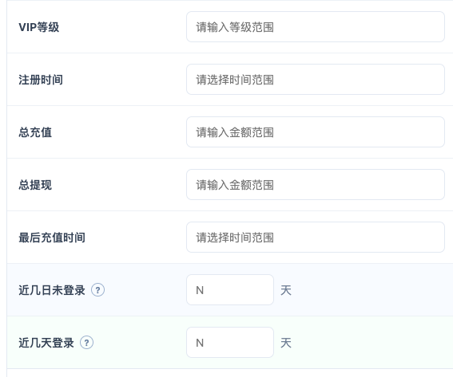
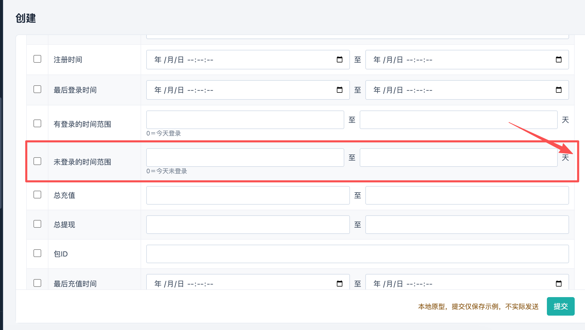

# 推送目标配置增加登录条件（260914）

更新日期：2026-09-16。

## 可视化原型

[平台后台推送配置](https://hdddong.github.io/LUCKY/admin/#menu=m11-1-3)

原型使用虚构演示数据，提交仅保存示例，不实际筛选用户或发送推送。

## 需求范围

平台后台 → 运营工具 → 推送配置 → 创建 → 推送目标配置 → 通过条件筛选。

## 需求内容

在现有条件表“最后登录时间”后增加两个并列条件，各有独立勾选框及范围输入：

| 条件文案 | 输入方式 | 单位 | 0 天含义 |
|---|---|---|---|
| 有登录的时间范围 | 起始天数 至 结束天数 | 天 | 今天有登录 |
| 未登录的时间范围 | 起始天数 至 结束天数 | 天 | 今天未登录 |

“未登录的时间范围”在起止天数范围后增加独立的“查询天数”输入框，单位为天。勾选未登录条件时，起止范围和查询天数均为必填；查询天数须为大于 0 的整数。该值作为未登录条件的查询天数随条件一并保存，不改变起止范围的含义。

- 两个时间范围均允许输入 `0`；`0 至 0` 分别表示今天有登录、今天未登录。
- 查询天数与未登录范围的起止天数是不同字段，不互相替代。
- 命中条件的用户接收该推送任务已配置的内容。

## 配置示例

假设当前时间为 **9 月 15 日 13:57**，天数从今天向前计算：0 天对应 9 月 15 日，3 天对应 9 月 12 日，5 天对应 9 月 10 日。

| 条件 | 填入范围 | 对应日期范围 | 示例含义 |
|---|---|---|---|
| 有登录的时间范围 | `3 至 5` 天 | 9 月 10 日至 9 月 12 日 | 在该时间范围内有登录 |
| 未登录的时间范围 | `0 至 3` 天，查询天数 `N` 天 | 9 月 12 日至 9 月 15 日当前时间 | 在该时间范围内未登录，并按配置的 N 天查询 |

查询天数 `N` 由配置人输入；本需求不指定其默认值或上限。

### 时间范围文字示意

当前时间：9 月 15 日 13:57。从今天向前看：

```text
今天（0 天前）        3 天前                 5 天前
9 月 15 日           9 月 12 日              9 月 10 日
    |------ 未登录 ------|------ 有登录 ------|
         0 至 3 天             3 至 5 天
```

## 页面关系

- 两个登录条件同时保留、分别勾选启用。
- 两个条件展示在“通过条件筛选”的条件表中，与原有“最后登录时间”范围分别保存。
- “查询天数”只属于“未登录的时间范围”，紧随其范围控件展示。
- 未勾选的条件不参与提交；目标方式切换为“按照用户ID”或“全部”时，不提交条件筛选分支的数据。
- 页签或目标方式切换保留已填草稿。
- 下方“触发条件”中的“未登录”与新增范围条件分开配置，不自动关联。
- 循环方式由推送基本配置控制，目标配置不重复展示每日或每周标注。

## 页面示意

原条件矩阵：



未登录范围与查询天数位置参考：



## 原型校验与验收

1. “有登录的时间范围”与“未登录的时间范围”各有独立勾选框、起止天数输入及“天”单位。
2. “查询天数”只显示在“未登录的时间范围”后；勾选该条件时须填写大于 0 的整数。
3. 两项范围分别填入 `0 至 0` 均可提交，0 值完整保存；未登录项还须填写查询天数。
4. 空范围、缺少一端、负数、小数及起始值大于结束值时提示修正；查询天数为空、为 0、负数或小数时提示修正。
5. 未启用条件不提交；切换页签后范围值和查询天数保留。
6. 当前为静态演示原型，提交仅保存示例，不实际筛选用户或发送推送；不以原型预估代替真实数据验收。
